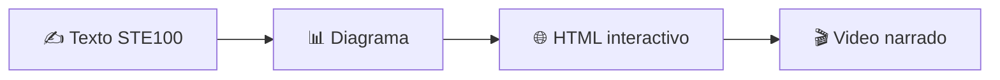
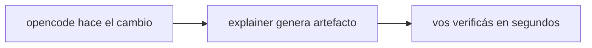

# explainer

Explicá un PR, cambio o concepto en el nivel justo: texto controlado, diagrama o página interactiva. Artefactos descartables para entender outputs de LLMs.

```bash
npx skills add lucasvidela94/explainer -a opencode -s explainer
```

## La idea

Viene de [Andrej Karpathy](https://x.com/karpathy/status/2105819303471976479):

> Pasaremos cada vez más tiempo entendiendo los outputs de los modelos. Pedí artefactos descartables a medida: texto en ASD-STE100, diagramas, páginas HTML interactivas, videos explicadores bespoke. A medida que la inteligencia y el código son abundantes, cosas que antes no tenían sentido crear ahora sí.

Su escalera, de barato a rico:



Y su tesis de fondo: los LLMs hacen el legwork, nuestro trabajo sube a **oversight y understanding**. Esta skill implementa eso: el agente hace el legwork (junta hechos, genera el artefacto), vos hacés oversight (verificás contra hechos).

## Cómo nos sirve

Con opencode abierto el flujo es:



En vez de releer un diff largo, pedís el nivel que corresponda y lo entendés en minutos. Cada nivel cuesta más que el anterior: empezá abajo, subí solo si hace falta.

## Niveles

| Nivel | Qué recibís | Cuándo |
|---|---|---|
| `text` | `explainer.md` estilo STE100 (o al 80%) | Leer rápido |
| `diagram` | `diagram.mmd` + SVG verificado | Flujos, protocolos, relaciones |
| `html` | Página autocontenida (Tailwind + Mermaid por CDN), se abre sola | Explorar a tu ritmo |

Video narrado queda **fuera a propósito**: evaluamos Psychopomp (motor Rust de motion graphics) y era bloat para el día a día — toolchain, build de minutos, GPU — lo opuesto a "descartable". Si un caso real lo pide, se diseña una vía liviana con ese caso en la mano.

## Uso

Parado en cualquier repo, en el chat de opencode:

```
usa la skill explainer, nivel text, para explicar qué hace este repo
y cuál es su cambio más importante del último commit.
Target: .
```

O directo por CLI (scaffold + hechos, el agente escribe el contenido):

```bash
scripts/explain.sh <pr-url|archivo|tema> --level text|diagram|html
```

## Arquitectura

```
skills/explainer/SKILL.md      # 4 pasos: hechos → nivel → generar → verificar
  references/STE100.md         # escritura controlada
  references/DIAGRAM.md        # Mermaid + verificación SVG
  references/HTML.md           # patrón single-file probado
scripts/explain.sh             # junta hechos, arma scaffold en out/
```

Reglas: lo barato primero, todo artefacto traza a hechos verificados, nada va al repo salvo que lo pidas.

## Research

- **Karpathy**: la escalera texto → diagrama → HTML → video y el frame legwork/oversight (link arriba).
- **Skills de Matt Pocock** (`improve-codebase-architecture`, `prototype`, `teach`, instaladas localmente): el patrón HTML que copiamos — single-file, Tailwind + Mermaid por CDN, a temp, auto-open con `xdg-open`. Probado en flujo diario.
- **Psychopomp** (`kitlangton/psychopomp`, Rust + wgpu): evaluado en esta máquina (compila, presenta, exporta). Potente pero pesado; descartado como backend por bloat. Queda en git history por si aparece un caso real de video.
