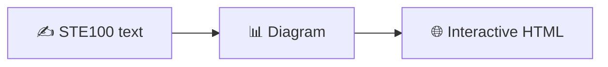
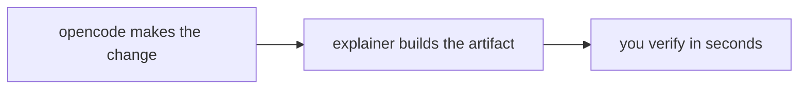

# explainer


Explain any PR, change or concept at the right level: controlled text, diagram or interactive HTML. Disposable artifacts for understanding LLM outputs.

```bash
npx skills add lucasvidela94/explainer -a opencode -s explainer
```

**Use when you say:**

- "Explain this PR to me"
- "What changed here and why?"
- "Help me understand this codebase"
- "Turn this into a diagram / an interactive page"

## The idea

From [Andrej Karpathy](https://x.com/karpathy/status/2105819303471976479):

> We'll be spending a lot more time trying to understand the outputs of language models. Ask for large, custom, disposable artifacts: ASD-STE100 writing, diagrams, interactive HTML pages, bespoke explainer videos. As intelligence and code become abundant, things that never made sense to create before now do.

His ladder, from cheap to rich:



And his underlying thesis: LLMs do the legwork, our work rises to oversight and understanding. This skill implements that: the agent does the legwork (gathers facts, builds the artifact), you do oversight (verify against facts).

## How it helps

With opencode open, the flow is:



Instead of re-reading a long diff, you ask for the right level and understand it in minutes. Each level costs more than the previous one: start low, move up only if needed.

## Levels

| Level | You get | When |
|---|---|---|
| `text` | `explainer.md` in STE100 style (or 80% of the way there) | Quick reading |
| `diagram` | `diagram.mmd` + verified SVG | Flows, protocols, relationships |
| `html` | Self-contained page (Tailwind + Mermaid via CDN), opens itself | Explore at your own pace |

## Usage

From any repo, in your agent's chat:

```
use the explainer skill, level text, to explain what this repo does
and its most important change in the last commit.
Target: .
```

```
with the above, move up to diagram level: a flowchart of the
facts -> level -> generate -> verify process.
```

Or directly via CLI (scaffold + facts, the agent writes the content):

```bash
scripts/explain.sh <pr-url|file|topic> --level text|diagram|html
```

## Structure

```
skills/explainer/SKILL.md      # 4 steps: facts → level → generate → verify
  references/STE100.md         # controlled writing
  references/DIAGRAM.md        # Mermaid + SVG verification
  references/HTML.md           # proven single-file pattern
scripts/explain.sh             # gathers facts, scaffolds into a fresh temp dir
```

Rules: cheap first, every claim traces to verified facts, nothing lands in the repo unless you ask.

Works with OpenCode, Claude Code, Cursor and any agent that reads `SKILL.md` (`npx skills add` installs it into yours).

## Sources

- **Karpathy**: the text → diagram → HTML → video ladder and the legwork/oversight frame (link above). We implement the first three levels; video was left out on purpose.
- **Matt Pocock's skills** (`improve-codebase-architecture`, `prototype`, `teach`): the HTML pattern we copied, single-file, Tailwind + Mermaid via CDN, to temp, auto-open with `xdg-open`. Proven in daily flow.
- **Psychopomp** (`kitlangton/psychopomp`, Rust + wgpu): evaluated on this machine (builds, presents, exports). Powerful but heavy; discarded as a video backend for bloat. Kept in git history in case a real video need shows up.

## License

MIT
